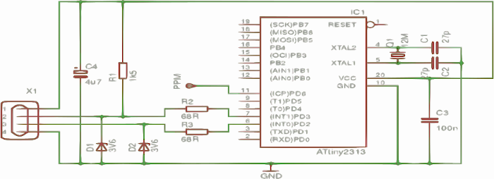
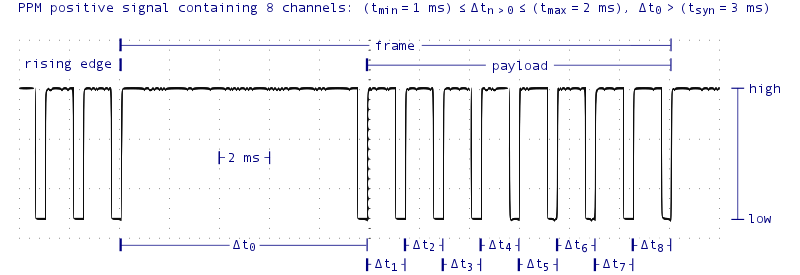

# Yet another USB Interface for RC Flight Simulators

This repository contains all essential parts for creating a USB interface for RC flight simulators, for instance, but not limited to, [neXt](http://rc-aerobatics.eu/) and [Heli-X](http://www.heli-x.info/cms/).

## Introduction

### Schematic

Just a few electronic components are needed for the USB interface. The ATtiny2313 microcontroller is clocked - due to the level of precision required - by an external 12 MHz oscillator. The ICP pin is directly connected to the PPM signal.



### Firmware

The payload of each PPM frame corresponds to channel values of the respective stick positions, switches or knobs of an RC transmitter at a particular time. For the synchronization of successive frames, every payload is introduced by a well identifiable and relatively long timeframe.



Rising edges are captured at the ICP pin for channel counting and estimation of channel values using the built-in 16-bit timer. The same timer is used to recognize timeframes for synchronization. It is of no significance whether a rising or falling edge is captured. Moreover, it makes no difference if PPM positive or negative is used.

The binary of the firmware is available to download on the [release page](https://github.com/m6c7l/ppm4joy/releases).

## Building

Make sure you have installed all essential packages on your system for building and flashing the firmware from source code:

* GNU Binutils: assembler, linker and many more
* AVR Libc: standard library for AVR development
* AVR GCC: cross-compiler for C/C++ targeting AVR microcontrollers
* AVRdude: reads/writes the memory of AVR microcontrollers via a programmer

On a Debian-based Linux all parts for building and flashing can be installed with one line:

```bash
$ sudo apt-get install avr-libc binutils-avr gcc-avr avrdude
```

For ease of use, a [Makefile](/sources/Makefile) for GNU make is provided. It aids in simplifying building program binaries. For creating the flash memory image (hex) just run:

```bash
$ make flash
```

If all went well, binaries created by AVR GCC will pop up. To revert everything that has taken place so far simply run:

```bash
$ make clean
```

## Flashing

For flashing a programmer is needed, e.g. [SI-Prog](http://www.lancos.com/siprogsch.html) as an example for a low-cost programmer or the bit over the top [JTAGICE3](http://www.atmel.com/tools/jtagice3.aspx). The Makefile contains a rule for flashing the flash memory image (hex) through AVRdude. Perhaps you have to adjust some variables - PROG, PORT, BAUD - before running:

```bash
$ make upload
```

## Help (for Linux users)

The USB interface can be used with most RC flight simulators running in Linux, however, tweaks may be required.

### Heli-X

Heli-X is written in Java and based on the 3D engine [jMonkeyEngine](http://jmonkeyengine.org/), hence it is utilizing the popular Java library [jinput](https://github.com/jinput/jinput) for accessing input devices. The library captures inputs via the native input event system. To list all USB interfaces recognized by your system make sure your user is a member of any group able to access input devices and run (or run as root):

```bash
$ evtest
```

You should see something like ```/dev/input/js0: m6c7l ppm4joy```, which is sufficient to make your radio transmitter work in Heli-X with the USB interface. To check the control of the USB interface input simply run:

```bash
$ jstest /dev/input/js0  # or whatever you saw in evtest
```

## neXt

neXt is a program developed with the game runtime and development platform [Unity 3D](https://unity3d.com/de). Since version 5.x of Unity 3D it is using an abstract layer called [SDL](https://www.libsdl.org/) to access all kinds of input devices. Make sure you have SDL libraries and utilities installed on your system. Run either of the following commands to list all joysticks SDL is able to see on your system:

```bash
$ sdl-jstest --list
$ sdl2-jstest --list
$ controllermap
```

At least one line like ```INFO: Joystick 0: m6c7l ppm4joy``` should be shown in the output. If the controller is not listed, the user has to be added to the input group to access input devices:

```bash
$ sudo usermod -a -G input $USER
```

Unfortunately, the SDL backend in Unity 3D accepts certain game controller classes only. Thus, the USB interface has to mimic a game controller which is considered to be a proper game controller for the Unity 3D runtime. This can be done by declaring an SDL configuration with four axes and two triggers mapped to six of the channel inputs of the USB interface in the environment before running neXt:

```bash
$ SDL_GAMECONTROLLERCONFIG="03000000c0160000dc05000001010000,m6c7l ppm4joy,leftx:a3,lefty:a2,rightx:a0,righty:a1,righttrigger:a7,lefttrigger:a5," ./neXt.x86_64
```

## Credits

- Objective Development Software GmbH -- [V-USB](https://github.com/obdev/v-usb)
- Thomas Pfeifer -- [PPM2USB](https://github.com/thomaspfeifer/PPM2USB)
- Megh Parikh -- [Handling joysticks and gamepads in linux](https://meghprkh.github.io/blog/2016/06/03/Handling-joysticks-and-gamepads-in-linux/)

